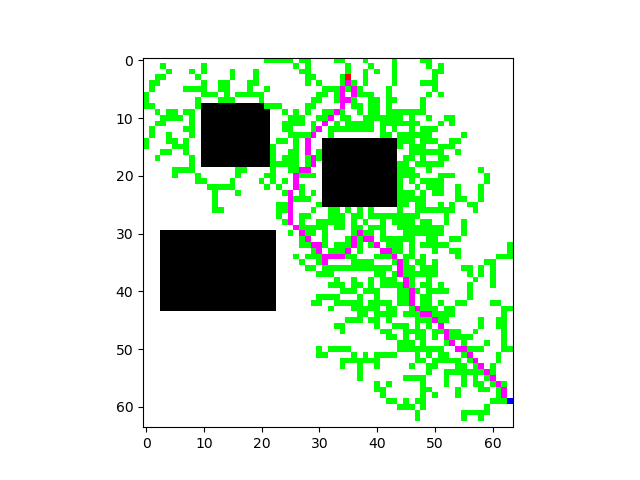
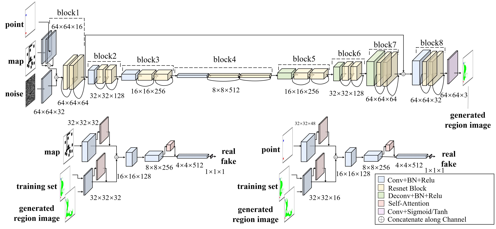
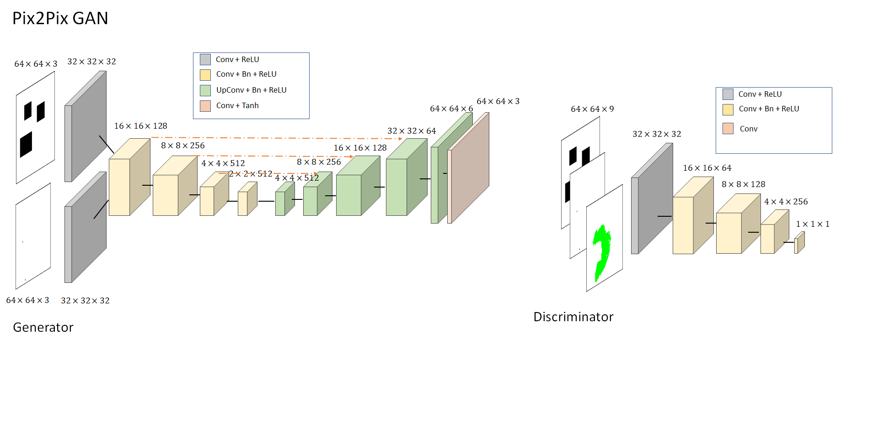
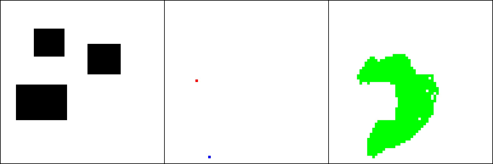
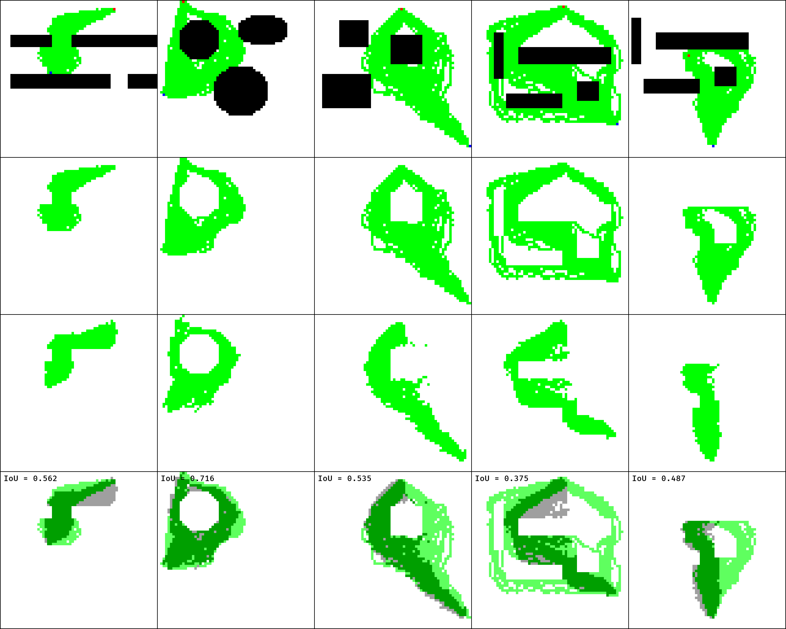
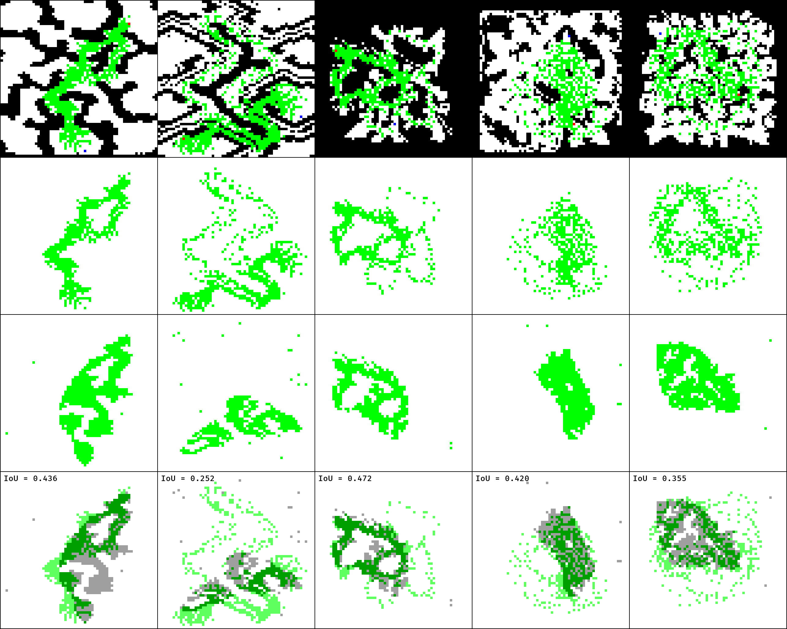
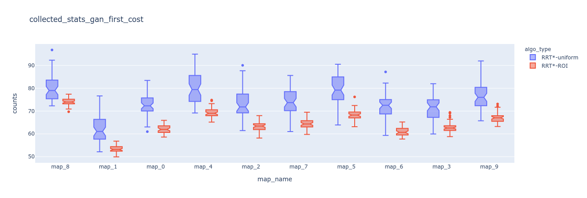
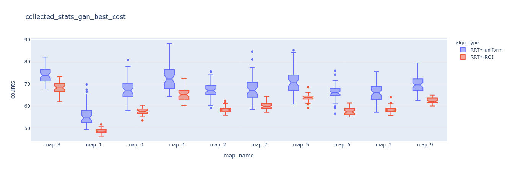
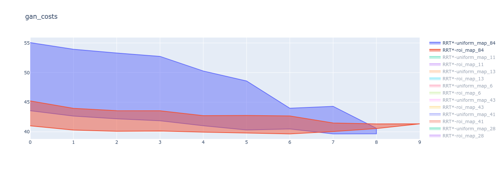
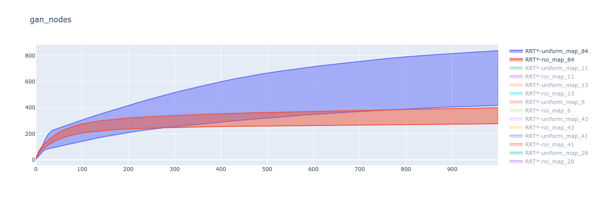

PathGAN
======================
A Pytorch implementation of [**Generative Adversarial Network for Heuristics of Sampling-based Path Planning**](https://arxiv.org/pdf/2012.03490.pdf)

```
    .
    ├── assets                  # Images, results
    ├── data                    # Dataset location & data generation
    │   ├── map_augmentator.py  
    │   ├── task_generator.py   
    │   ├── roi_generator.py 
    │   ├── rrt.py
    │   ├── utils.py 
    │   └── dataset
    ├── gan                     # Scripts for GANs (original & pix2pix)
    │   ├── generator.py        
    │   ├── discriminator.py    
    │   ├── modules.py          
    │   ├── checkpoint            
    │   ├── utils
    |   |   ├── data.py
    |   |   ├── criterion.py
    |   |   ├── metrics.py
    |   |   └── trainer.py
    │   └── pix2pix
    |       ├── blocks.py
    |       ├── trainer.py
    |       └── utils.py
    ├── path                    # Scripts for pathfinding
    │   ├── rrt_base.py         # Abstract class with common functions for RRT and RRT*
    |   |── rrt.py              
    │   ├── rrt_star.py
    │   └── utils.py            # Functions for statistics collection and processing
    ├── results                 # htmp pages with collected stats for RRT*
    |
    ├── train.py                # To train GAN from the paper 
    ├── train_pix2pix.py        # To tran our Pix2Pix GAN 
    ├── roi_generation.ipynb    # To generate ROIs
    |── get_logs.py             # Wrapper for logs generation and processing
    |── app.py                  # Dash app to display plots via plotly
    ├── requirements.txt
    ├── LICENSE
    └── README.md
```
### Install

* Clone repo and change directory
  ```
  git clone https://github.com/akanametov/pathgan
  cd pathgan/
  ```
* Install dependencies
	```
    pip install -r requirements.txt
	```
* Download generated dataset
	```
    bash download.sh
	```
* Download MovingAI dataset
	```
    bash download_movingai.sh
	```

  
## Content

- [Introduction](#introduction)
- [Dataset](#dataset)
- [Training](#training)
- [Results](#results)
- [License](#license)
- [Links](#links)

### Introduction

The overall structure of the PathGAN consists of two 'parts':
1) RRT* pathfinding algorithm and
2) Generative Aversarial Network for promising region generation (or regions of interest, ROI). Generated ROI are used for non--uniform sampling in RRT* to reduce search space and improve convergence to the optimal path (instead of uniform sampling). As followed by the paper, ground truth images for training GAN are generated by running RRT 50 times on each task and saving all obtained paths between initial and goal nodes.

* Pathfinding algorithm
```
Input: x_init, x_goal, grid_map
Output: G(V, E)
V = [x_init] # nodes
E = {} # edges in the form E[child] = parent
x_max, y_max = grid_map.shape

# output from trained GAN
roi_map = ROIGenerator(x_init, x_goal, grid_map)
# get list of nodes coordinates from ROI
xy_roi = Discretize(roi_map)

for i in range(MAX_ITER):
  # sample uniform with PROB from [0, x_max) * [0, y_max)
  # otherwise sample uniform from xy_roi
  xy_rand = SampleFreeNode(roi_map, x_max, y_max, PROB)
  xy_near = Nearest(xy_rand)
  xy_new = Steer(xy_near, xy_rand, MAX_EDGE_LEN)
  if xy_new not in V and CellFree(xy_new):
    xy_neighbors = Nearest(xy_new, SEARCH_RADIUS)
    # choose best parent to get obstacle free path to xy_new, xy_init->xy_near_best->xy_new
    xy_near_best = GetBestNeighbor(xy_init, xy_new, xy_neighbors)
    if ObstacleFree(xy_near_best, xy_new):
       V.append(xy_new)
       E[xy_new] = xy_near_best
       # try to obtain shorter paths through xy_new: xy_init->xy_new->xy_neighbor (for all xy_neighbors)
       Rewire(xy_init, xy_new, xy_neighbors)
return (V, E)
```
> Pathfinding example by RRT* with ROI heuristic




* GAN architecture: Original

<a></a>

* GAN architecture: Pix2Pix

<a></a>

### Dataset

* Generated dataset

In this project we provide generated dataset of 10,000 samples (`Map`, `Point`, `ROI`):**
- train set (8,000 samples)
- test set (2,000 samples)
<a><div class="column">
    
</div></a>

*download dataset through the [link](https://disk.yandex.ru/d/mgf5wtQrld0ygQ)*
* Generating dataset

In the case if you wish to create your own dataset we also provide some `python` scripts.
Before to create a dataset make sure that you have some initial maps saved as `.png` files.
The dataset can be generated in 4 steps:
  * Change directory
    ```
    cd data/
    ```
  * Augment initial maps (not required, just in the case you have not enough maps)
    ```
    ./pathgan/data> python map_augmentator.py [--load_dir LOAD_DIR] [--save_dir SAVE_DIR] [--height_shift HEIGHT_SHIFT] [--width_shift WIDTH_SHIFT] [--shift_step SHIFT_STEP] [--rot_prob ROT_PROB] [--n_maps N_MAPS]
    ```
  * Generate tasks
    ```
    ./pathgan/data> python task_generator.py [--load_dir LOAD_DIR] [--save_dir SAVE_DIR] [--min_length MIN_LENGTH] [--n_tasks N_TASKS]
    ```
  * Generate MovingAi tasks
    ```
    ./pathgan/data> python OpenAI_task_generator.py [--load_dir LOAD_DIR] [--save_dir SAVE_DIR] [--min_length MIN_LENGTH] [--n_tasks N_TASKS]
    ```
  * Generate ROIs
    ```
    ./pathgan/data> python roi_generator.py [--start START] [--to TO] [--map_dir MAP_DIR] [--task_dir TASK_DIR] [--save_dir SAVE_DIR] [--n_runs N_RUNS]
    ```
  * Generate MovingAI ROIs
    ```
    ./pathgan/data> python OpenAI_roi_gen.py
    ```

*for more information on parameters of dataset creation refer to [DATASET.md](DATASET.md)*


### Training

* Original GAN training
  ```
  ./pathgan> python train.py [--batch_size BATCH_SIZE] [--epochs EPOCHS] [--g_lr G_LR] [--md_lr MD_LR] [--pd_lr PD_LR] [--load_dir LOAD_DIR] [--save_dir SAVE_DIR]
  ```
* Pix2Pix GAN training
  ```
  ./pathgan> python train_pix2pix.py [--batch_size BATCH_SIZE] [--epochs EPOCHS] [--g_lr G_LR] [--d_lr D_LR] [--load_dir LOAD_DIR] [--save_dir SAVE_DIR]
  ```

In order to finetune pretrained Generator download weights through the links below:

| GAN           | # of params * | Checkpoint * |
| ------------- |:--------------:|:------------:|
| Original (from paper)| 21,231,827 | [Link](https://disk.yandex.ru/d/4hQqaZPNoktXag) | 
| Pix2Pix (ours)| 4,170,477 | [Link](https://disk.yandex.ru/d/Lzbj46Y7caTJSA) |

*- 
of Generator

*for more information on parameters of GANs training refer to [TRAINING.md](TRAINING.md)*

### Path metrics generation 
To run RRT* and RRT* with heuristic set `data_folder`, `maps_folder` name inside `dataset_folder` (our `result.csv` contained its name), `results_folder` (should be inside `data_folder`) and `results_file` inside `results_folder`.  Here is example:
```
./pathgan>./get_logs.py A \  
--map_params "{'data_folder': './data', 'maps_folder': 'maps', 'results_folder': 'results_pix2pix', 'results_file': 'result.csv'}" \  
--rrt_params "{'path_resolution': 1, 'step_len': 2, 'max_iter': 10000}" \  
--mu 0.1 --gamma 10 --n 50 --output_dir logs --output_fname pix2pix_logs.txt
```
You will obtain text file of dicts in the following format
```
{
	'map_name': ..., 
	'first': {
			'cost': [...], 
			'time_it': [...], 
			'time_sec': [...], 
			'nodes_taken': [...], 
			'samples_taken': [...]
		}
	'best': {
			'cost': [...], 
			'time_it': [...], 
			'time_sec': [...], 
			'nodes_taken': [...], 
			'samples_taken': [...]
		}
	'costs': {'mean': [...], 'std': [...]},  
	'paths': {'mean': [...], 'std': [...]},  
	'samples': {'mean': [...], 'std': [...]},  
	'nodes': {'mean': [...], 'std': [...]}
}
```
Here `'first'` and `'best'` are statistics for first and best paths found by RRT*  and collected `n` times (from `get_logs.py` above).  Another statictics are:
* `costs` - costs of every found path (ordered by iterations) averaged by `n` runs
*  `paths` - path lengths (ordered by iterations) averaged by `n` runs
* `samples` -  unique nodes sampled (ordered by iterations, but may be not included in returned graph), checked every 10 iterations and averaged by `n` runs
* `nodes` - nodes in graph (ordered by iterations), checked every 10 iterations and averaged by `n` runs
To collect statistics (`.csv` and dicts for line plots) run
```
./pathgan>./get_logs.py B --log_dir logs --log_file pix2pix_logs.txt [--collect_stats]
```
For more details see [LOGS.md](LOGS.md).  After that run `app.py` - you will get html-pages with fancy plots! :)

Obtained RRT* logs for our data sets are available [here](https://disk.yandex.ru/d/iG8Qqa5qFB1nLg).

### Results

**GAN results**
* **Original vs Pix2Pix on Generated dataset**
  <a><div class='column'>
      
      
  </div></a>

  | GAN                  |      mIoU     |    mDICE    |    mFID    |    mIS    |   # of params *  |
  | -------------------- |:-------------:|:-----------:|:----------:|:---------:|:----------------:|
  | Original (from paper)|   **70.2%**   |  **82.0%**  |  **79.7**  |  **1.019**|     21,231,827   |
  | Pix2Pix (ours)       |     58.1%     |    72.2%    |    91.2    |    1.017  |    **4,170,477** |

  *- 
  of Generator

  - mIoU - `average Intersection over Union` for all 2,000 samples in `test set`

  - mDICE -`average DICE` for all 2,000 samples in `test set`

  - mFID -`average Frechet Inception Distance` for all 2,000 samples in `test set`

  - mIS - `average Inception Score` for all 250 batches (2,000 samples/8 samples per batch) in `test set`

* **Original vs Pix2Pix on MovingAI dataset**
  <a><div class='column'>
      
      
  </div></a>

  | GAN                      |      mIoU     |    mDICE    |    mFID    |    mIS    |   # of params *  |
  | ------------------------ |:-------------:|:-----------:|:----------:|:---------:|:----------------:|
  | **Original (from paper)**|    **38.4%**  |  **53.8%**  |   **88.1** | **1.014** |     21,231,827   |
  | Pix2Pix (ours)           |      30.8%    |    46.3%    |    100.1   |   1.012   |    **4,170,477** |

  *- 
  of `Generator`

  - mIoU - `average Intersection over Union` for all 699 samples

  - mDICE -`average DICE` for all 699 samples

  - mFID -`average Frechet Inception Distance` for all 699 samples

  - mIS - `average Inception Score` for all 88 batches (699 samples/8 samples per batch)

**Connectivity**

We run RRT on outputs of trained GAN and Pix2pix (ROI considered as free space, other regions-as obstacles). It should be noted that GAN and Pix2Pix saw MovingAI maps first time (it was sort of generalization ability test).

| GAN                   |    Generated   |    MovingAI    |
| --------------------- |:--------------:|:--------------:|
| Original (from paper) |    **65.8%**   |      54.5%     |
| **Pix2Pix (ours)**    |      65.4%     |    **67.4%**   |

**Optimality**

We run RRT* with ROI heuristic (non-uniform sampling) and without it (uniform sampling) for 50 times on each type of maps presented in test set (from our initial maps on which models were trained, and MovingAI maps which were not seen by the models).  We collected statistics described in section [above](#path-metrics-generation). For RRT* we use `step_len=4`, `path_resolution=1`, `mu=0.1`, `max_iter=10000`, `gamma=10` for all maps.

You can check full reports at repo [results](results) folder or via [github-pages](https://akanametov.github.io/pathgan/results/).

As mentioned, we evaluated:
1. Cost, time in seconds, time in iterations, nodes taken in graph and overall nodes sampled for **first found** and **best found** paths (compared by Euclidean distance from xy_init to xy_goal)
2. All costs and found path length (#nodes)
3. Nodes sampled and nodes added in graph, checked every 10 iterations.

Here are few plots.
<a>
    <div class='column'>
        
        
        
        
  </div>
</a>

From reports we can see that RRT* with ROI outperforms RRT* with uniform sampling in most cases (in terms of found paths costs, convergence speed to the optimal path and nodes taken and sampled, even if model didn't see given type of map). 

### License

This project is licensed under MIT.

### Links

* [Generative Adversarial Network based Heuristics for Sampling-based Path Planning (arXiv article)](https://arxiv.org/pdf/2012.03490.pdf)
* [Dataset (generated)](https://disk.yandex.ru/d/mgf5wtQrld0ygQ)
* [MovingAI Dataset](https://disk.yandex.ru/d/0QJSjzVy_ay0mw)
* [Results (ROI's) of Original Generator (from paper)](https://disk.yandex.ru/d/mEv-kuVkGcV40Q)
* [Results (ROI's) of Pix2Pix Generator (ours)](https://disk.yandex.ru/d/IqwqTjVoTkwMZw)
* [MovingAI results (ROI's) of Original Generator (from paper)](https://disk.yandex.ru/d/qIws1FoEWAvVqA)
* [MovingAI results (ROI's) of Pix2Pix Generator (ours)](https://disk.yandex.ru/d/HgmkUZEzDeIvrQ)
* [Collected logs from RRT*](https://disk.yandex.ru/d/iG8Qqa5qFB1nLg)
* [Full collected stats report](https://akanametov.github.io/pathgan/results/)
