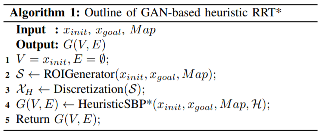
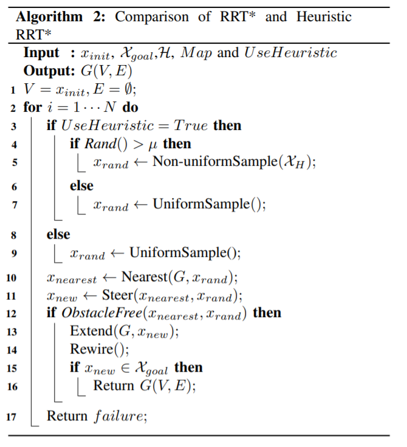
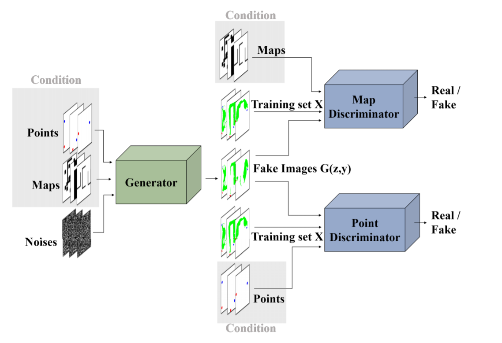
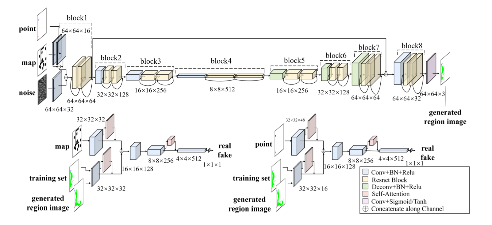

PathGAN
======================
A Pytorch implementation of Generative Adversarial Network for Heuristics of Sampling-based Path Planning

[arXiv article](https://arxiv.org/pdf/2012.03490.pdf)

## Table of content

- [Structure](#structure)
  - [Searching algorithm](#searching-algorithm)
  - [GAN architecture](#gan-architecture)
- [Dataset](#dataset)
- [Training](#training)
- [Results](#results)
- [License](#license)
- [Links](#links)

## Structure

The overall structure of the PathGAN consists of two things:
1) RRT* searching algorithm and
2) Generative Aversarial Network for promising region generation 

### Searching algorithm

`RRT*` algorithm:

Comparing `RRT*` and `Heuristic RRT*`:

### GAN architecture

Overall GAN architecture:

GAN architecture in details:

## Dataset

## Training

## Results

## License

This project is licensed under MIT.

## Links

* [Generative Adversarial Network based Heuristics
for Sampling-based Path Planning (arXiv article)](https://arxiv.org/pdf/2012.03490.pdf)

* [GAN Path Finder (arXiv article)](https://arxiv.org/pdf/1908.01499.pdf)
