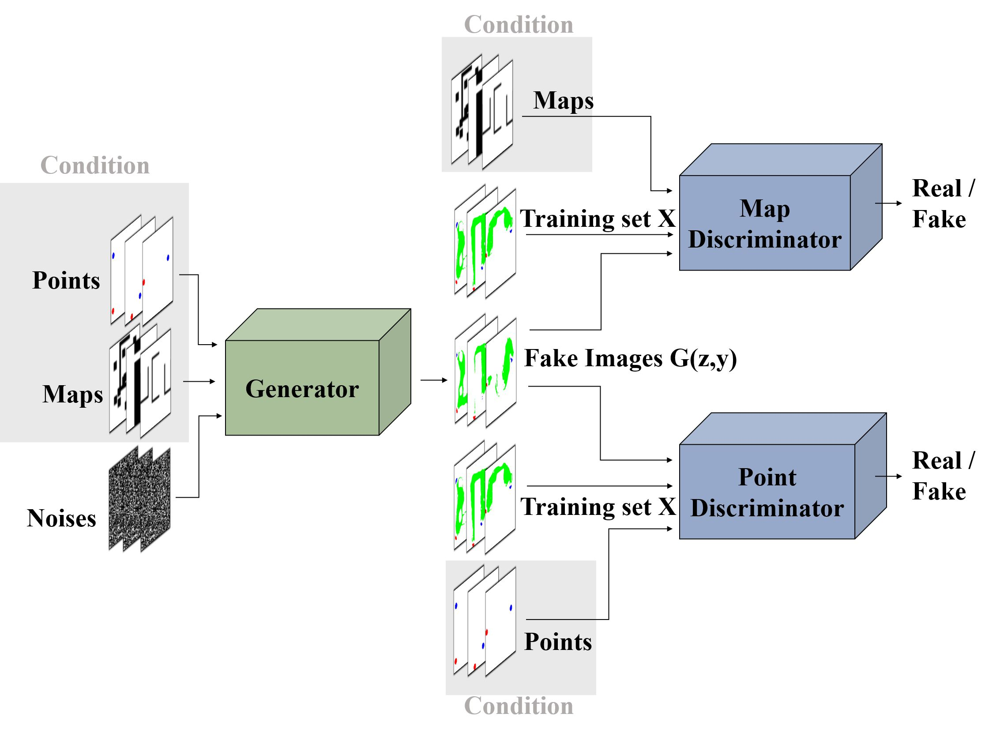
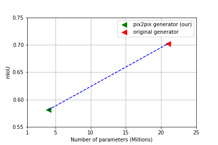

PathGAN
======================
A Pytorch implementation of **Generative Adversarial Network for Heuristics of Sampling-based Path Planning**

[Original arXiv paper](https://arxiv.org/pdf/2012.03490.pdf)

```
    .
    ├── assets                  # Images, results
    ├── data                    # Dataset location & data generation
    │   ├── map_augmentator.py  
    │   ├── task_generator.py   
    │   ├── roi_generator.py 
    │   ├── rrt.py
    │   ├── utils.py 
    │   └── dataset
    ├── gan                     # Scripts for GANs (original & pix2pix)
    │   ├── generator.py        
    │   ├── discriminator.py    
    │   ├── modules.py          
    │   ├── checkpoint            
    │   ├── utils
    |   |   ├── data.py
    |   |   ├── criterion.py
    |   |   ├── metrics.py
    |   |   └── trainer.py
    │   └── pix2pix
    |       ├── blocks.py
    |       ├── trainer.py
    |       └── utils.py
    ├── path                    # Scripts for pathfinding
    │   ├── rrt.py              
    │   ├── rrt_star.py         
    │   ├── RRT_updated.py 
    │   └── RRT_.py  
    ├── train.py                # To train GAN from the paper 
    ├── train_pix2pix.py        # To tran our Pix2Pix GAN 
    ├── roi_generation.ipynb    # To generate ROIs
    ├── LICENSE
    └── README.md
```

## Table of content

- [Structure](#structure)
  - [Searching algorithm](#searching-algorithm)
  - [GAN architecture](#gan-architecture)
- [Dataset](#dataset)
- [Training](#training)
- [Results](#results)
- [License](#license)
- [Links](#links)


## Structure

The overall structure of the PathGAN consists of two things:
1) RRT* searching algorithm and
2) Generative Aversarial Network for promising region generation 

### Searching algorithm

**`RRT*` algorithm:**

<a></a>

**Comparing `RRT*` and `Heuristic RRT*`:**

<a></a>

### GAN architecture

**Overall `GAN` architecture:**

<a></a>

**`GAN` architecture in details:**

<a></a>

## Dataset

**[Dataset](https://disk.yandex.ru/d/mgf5wtQrld0ygQ) of 10,000 samples (`Map`, `Point`, `ROI`):**
- train set (8,000 samples)
- test set (2,000 samples)

## Training

## Results

**[Results](https://disk.yandex.ru/d/mEv-kuVkGcV40Q) on `test set` of [dataset](https://disk.yandex.ru/d/mgf5wtQrld0ygQ) above:**

### Results of `GAN's`

| GAN           |      mIoU     |    mDICE    |    mFID    |    mIS    | Number of params * |
| ------------- |:-------------:|:-----------:|:----------:|:---------:|:------------------:| 
| Original      |    70.2%      |    82.0%    |    79.7    |   1.019   |     21,231,827     |
| Pix2Pix       |    58.1%      |    72.2%    |    91.2    |   1.017   |      4,170,477     |

*- parameters of `Generator`

- **mIoU - `average Intersection over Union` for all 2,000 samples in `test set`**

- **mDICE -`average DICE` for all 2,000 samples in `test set`**

- **mFID -`average Frechet Inception Distance` for all 2,000 samples in `test set`**

- **mIS - `average Inception Score` for all 250 batches (2,000 samples/8 samples per batch) in `test set`**


<a></a>

### Results of our `pix2pix Generator`

**RRT result`-->` True ROI `-->` Pred ROI `-->`True ROI ∩ Pred ROI**

<a></a>

### Comparing `Generators`

<a></a>

## License

This project is licensed under MIT.

## Links

* **[Generative Adversarial Network based Heuristics for Sampling-based Path Planning (arXiv article)](https://arxiv.org/pdf/2012.03490.pdf)**

* **[Dataset](https://disk.yandex.ru/d/mgf5wtQrld0ygQ)**

* **[Results](https://disk.yandex.ru/d/mEv-kuVkGcV40Q)**
