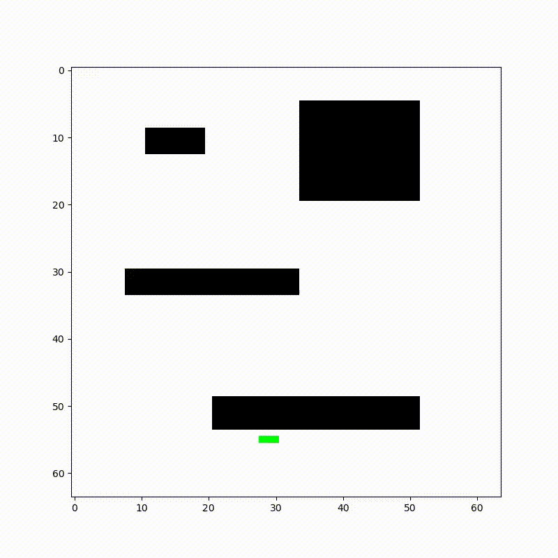
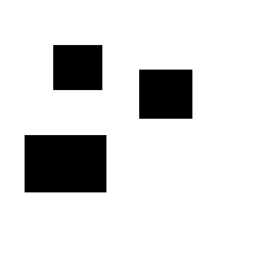
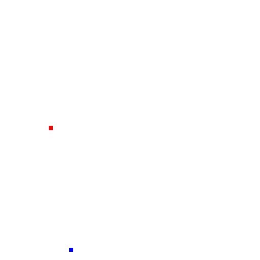
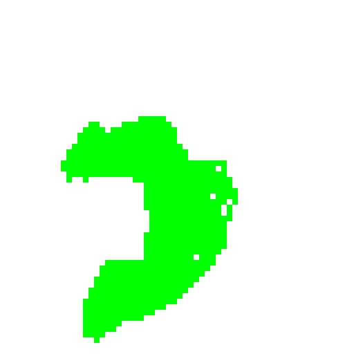

PathGAN
======================
A Pytorch implementation of **Generative Adversarial Network for Heuristics of Sampling-based Path Planning**

[Original arXiv paper](https://arxiv.org/pdf/2012.03490.pdf)

```
    .
    ├── assets                  # Images, results
    ├── data                    # Dataset location & data generation
    │   ├── movingai
    │   ├── map_augmentator.py  
    │   ├── task_generator.py   
    │   ├── roi_generator.py 
    │   ├── rrt.py
    │   ├── utils.py 
    │   └── dataset
    ├── gan                     # Scripts for GANs (original & pix2pix)
    │   ├── generator.py        
    │   ├── discriminator.py    
    │   ├── modules.py          
    │   ├── checkpoint            
    │   ├── utils
    |   |   ├── data.py
    |   |   ├── criterion.py
    |   |   ├── metrics.py
    |   |   └── trainer.py
    │   └── pix2pix
    |       ├── blocks.py
    |       ├── trainer.py
    |       └── utils.py
    ├── path                    # Scripts for pathfinding
    │   ├── rrt.py              
    │   ├── rrt_star.py         
    │   ├── RRT_updated.py 
    │   └── RRT_.py  
    ├── train.py                # To train GAN from the paper 
    ├── train_pix2pix.py        # To tran our Pix2Pix GAN 
    ├── roi_generation.ipynb    # To generate ROIs
    ├── LICENSE
    └── README.md
```

## Table of content

- [Introduction](#introduction)
  - [Searching algorithm](#searching-algorithm)
  - [GAN architecture](#gan-architecture)
- [Dataset](#dataset)
- [Results](#results)
- [License](#license)
- [Links](#links)


## Introduction

The overall structure of the PathGAN consists of two things:
1) RRT* searching algorithm and
2) Generative Aversarial Network for promising region generation 

### Searching algorithm

<a></a>

**Path searching by `RRT*`**



### GAN architecture

<a></a>

## Dataset

**Dataset consists of 10,000 samples (`Map`, `Point`, `ROI`):**

<a><div class="column">
    
    
    
</div></a>

- train set (8,000 samples)
- test set (2,000 samples)

**[Link to the dataset](https://disk.yandex.ru/d/mgf5wtQrld0ygQ)**

## Results

| GAN           | Generated ROI's |      mIoU     |    mDICE    |    mFID    |    mIS    | # of params * | Checkpoint * |
| ------------- |:--------------:|:-------------:|:-----------:|:----------:|:---------:|:------------------:|:------------:|
| Original (from paper)|[Link](https://disk.yandex.ru/d/mEv-kuVkGcV40Q)| 70.2% | 82.0% | 79.7 | 1.019 | 21,231,827 | [Link](https://disk.yandex.ru/d/4hQqaZPNoktXag) | 
| Pix2Pix (ours)|[Link](https://disk.yandex.ru/d/IqwqTjVoTkwMZw)| 58.1% | 72.2% | 91.2 | 1.017 | 4,170,477 | [Link](https://disk.yandex.ru/d/Lzbj46Y7caTJSA) |

*- 
of `Generator`

- mIoU - `average Intersection over Union` for all 2,000 samples in `test set`

- mDICE -`average DICE` for all 2,000 samples in `test set`

- mFID -`average Frechet Inception Distance` for all 2,000 samples in `test set`

- mIS - `average Inception Score` for all 250 batches (2,000 samples/8 samples per batch) in `test set`

`Original Generator (from paper)`
<a><div title="Original (from paper)">
    
</div></a>

**RRT result`-->` True ROI `-->` Pred ROI `-->`True ROI ∩ Pred ROI**

`Pix2Pix Generator (ours)`
<a><div title="Pix2Pix (ours)">
    
</div></a>

**RRT result`-->` True ROI `-->` Pred ROI `-->`True ROI ∩ Pred ROI**

## License

This project is licensed under MIT.

## Links

* [Generative Adversarial Network based Heuristics for Sampling-based Path Planning (arXiv article)](https://arxiv.org/pdf/2012.03490.pdf)
* [Dataset](https://disk.yandex.ru/d/mgf5wtQrld0ygQ)
* [Results (ROI's) of Original Generator (from paper)](https://disk.yandex.ru/d/mEv-kuVkGcV40Q)
* [Results (ROI's) of Pix2Pix Generator (ours)](https://disk.yandex.ru/d/IqwqTjVoTkwMZw)
