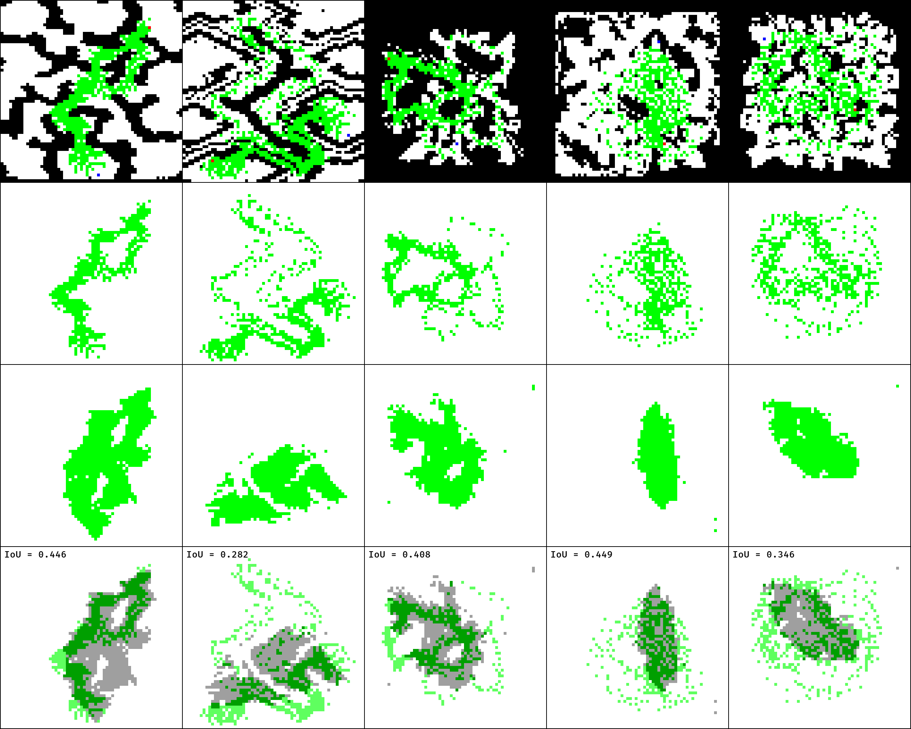
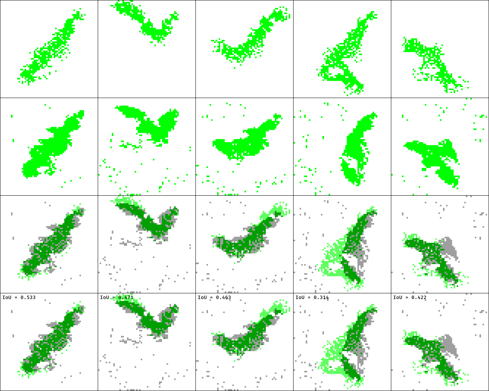

PathGAN
======================
A Pytorch implementation of [**Generative Adversarial Network for Heuristics of Sampling-based Path Planning**](https://arxiv.org/pdf/2012.03490.pdf)

```
    .
    ├── assets                  # Images, results
    ├── data                    # Dataset location & data generation
    │   ├── movingai
    │   ├── map_augmentator.py  
    │   ├── task_generator.py   
    │   ├── roi_generator.py 
    │   ├── rrt.py
    │   ├── utils.py 
    │   └── dataset
    ├── gan                     # Scripts for GANs (original & pix2pix)
    │   ├── generator.py        
    │   ├── discriminator.py    
    │   ├── modules.py          
    │   ├── checkpoint            
    │   ├── utils
    |   |   ├── data.py
    |   |   ├── criterion.py
    |   |   ├── metrics.py
    |   |   └── trainer.py
    │   └── pix2pix
    |       ├── blocks.py
    |       ├── trainer.py
    |       └── utils.py
    ├── path                    # Scripts for pathfinding
    │   ├── rrt.py              
    │   ├── rrt_star.py         
    │   ├── RRT_updated.py 
    │   └── RRT_.py  
    ├── train.py                # To train GAN from the paper 
    ├── train_pix2pix.py        # To tran our Pix2Pix GAN 
    ├── roi_generation.ipynb    # To generate ROIs
    ├── LICENSE
    └── README.md
```
### Install
* Clone repo
  ```
  git clone https://github.com/akanametov/pathgan
  ```
* Change directory
  ```
  cd pathgan/
  ```
  
## Content

- [Introduction](#introduction)
- [Dataset](#dataset)
- [Training](#training)
- [Results](#results)
- [License](#license)
- [Links](#links)

### Introduction

The overall structure of the PathGAN consists of two things:
1) RRT* searching algorithm and
2) Generative Aversarial Network for promising region generation 

* Pathfinding algorithm

<a></a>

* GAN architecture

<a></a>


Path searching by RRT*


### Dataset

* Generated dataset

In this project we provide generated dataset of 10,000 samples (`Map`, `Point`, `ROI`):**
- train set (8,000 samples)
- test set (2,000 samples)
<a><div class="column">
    
</div></a>

*download dataset through the [link](https://disk.yandex.ru/d/mgf5wtQrld0ygQ)*
* Generating dataset

In the case if you wish to create your own dataset we also provide some `python` scripts.
Before to create a dataset make sure that you have some initial maps saved as `.png` files.
The dataset can be generated in 4 steps:
  * Change directory
    ```
    cd data/
    ```
  * Augment initial maps (not required, just in the case you have not enough maps)
    ```
    ./pathgan/data> python map_augmentator.py [--load_dir LOAD_DIR] [--save_dir SAVE_DIR] [--height_shift HEIGHT_SHIFT] [--width_shift WIDTH_SHIFT] [--shift_step SHIFT_STEP] [--rot_prob ROT_PROB] [--n_maps N_MAPS]
    ```
  * Generate tasks
    ```
    ./pathgan/data> python task_generator.py [--load_dir LOAD_DIR] [--save_dir SAVE_DIR] [--min_length MIN_LENGTH] [--n_tasks N_TASKS]
    ```
  * Generate ROIs
    ```
    ./pathgan/data> python roi_generator.py [--start START] [--to TO] [--map_dir MAP_DIR] [--task_dir TASK_DIR] [--save_dir SAVE_DIR] [--n_runs N_RUNS]
    ```

*for more information on dataset creation refer to [DATASET.md](DATASET.md)*

### Training

* Original GAN training
  ```
  ./pathgan> python train.py [--batch_size BATCH_SIZE] [--epochs EPOCHS] [--g_lr G_LR] [--md_lr MD_LR] [--pd_lr PD_LR] [--load_dir LOAD_DIR] [--save_dir SAVE_DIR]
  ```
* Pix2Pix GAN training
  ```
  ./pathgan> python train_pix2pix.py [--batch_size BATCH_SIZE] [--epochs EPOCHS] [--g_lr G_LR] [--d_lr D_LR] [--load_dir LOAD_DIR] [--save_dir SAVE_DIR]
  ```

In order to finetune pretrained Generator download weights through the links below:

| GAN           | # of params * | Checkpoint * |
| ------------- |:--------------:|:------------:|
| Original (from paper)| 21,231,827 | [Link](https://disk.yandex.ru/d/4hQqaZPNoktXag) | 
| Pix2Pix (ours)| 4,170,477 | [Link](https://disk.yandex.ru/d/Lzbj46Y7caTJSA) |

*- 
of Generator

*for more information on GANs training refer to [TRAINING.md](TRAINING.md)*

### Results

* GAN results
 
  | GAN                  |      mIoU     |    mDICE    |    mFID    |    mIS    |   # of params * |
  | -------------------- |:-------------:|:-----------:|:----------:|:---------:|:----------------:|
  | Original (from paper)|     70.2%     |    82.0%    |    79.7    |    1.019  |     21,231,827   |
  | Pix2Pix (ours)       |     58.1%     |    72.2%    |    91.2    |    1.017  |      4,170,477   |

    *- 
    of Generator
    
    - mIoU - `average Intersection over Union` for all 2,000 samples in `test set`

    - mDICE -`average DICE` for all 2,000 samples in `test set`

    - mFID -`average Frechet Inception Distance` for all 2,000 samples in `test set`

    - mIS - `average Inception Score` for all 250 batches (2,000 samples/8 samples per batch) in `test set`

* Conn
  | GAN                   |    Generated   |    MovingAI    |
  | --------------------- |:--------------:|:--------------:|
  | Original (from paper) |      65.8%     |      54.5%     |
  | Pix2Pix (ours)        |      65.4%     |      67.4%     |


Original Generator (from paper) vs Pix2Pix Generator (ours)
<a><div title="Original (from paper)">
    
    
</div></a>

**RRT result`-->` True ROI `-->` Pred ROI `-->`True ROI ∩ Pred ROI**

## Results on `MovingAI` maps


| GAN           | Generated ROI's |      mIoU     |    mDICE    |    mFID    |    mIS    |
| ------------- |:--------------:|:-------------:|:-----------:|:----------:|:---------:|
| Original (from paper)|[Link](https://disk.yandex.ru/d/qIws1FoEWAvVqA)| 38.4% | 53.8% | 88.1 | 1.014 | 
| Pix2Pix (ours)|[Link](https://disk.yandex.ru/d/HgmkUZEzDeIvrQ)| 30.8% | 46.3% | 100.1 | 1.012 |

*- 
of `Generator`

- mIoU - `average Intersection over Union` for all 699 samples

- mDICE -`average DICE` for all 699 samples

- mFID -`average Frechet Inception Distance` for all 699 samples

- mIS - `average Inception Score` for all 88 batches (699 samples/8 samples per batch)

`Original Generator (from paper)`
<a><div title="Original (from paper)">
    
</div></a>

**True ROI `-->` Pred ROI `-->`True ROI ∩ Pred ROI**

`Pix2Pix Generator (ours)`
<a><div title="Pix2Pix (ours)">
    
</div></a>

**True ROI `-->` Pred ROI `-->`True ROI ∩ Pred ROI**

### License

This project is licensed under MIT.

### Links

* [Generative Adversarial Network based Heuristics for Sampling-based Path Planning (arXiv article)](https://arxiv.org/pdf/2012.03490.pdf)
* [Dataset (generated)](https://disk.yandex.ru/d/mgf5wtQrld0ygQ)
* [MovingAI Dataset](https://disk.yandex.ru/d/0QJSjzVy_ay0mw)
* [Results (ROI's) of Original Generator (from paper)](https://disk.yandex.ru/d/mEv-kuVkGcV40Q)
* [Results (ROI's) of Pix2Pix Generator (ours)](https://disk.yandex.ru/d/IqwqTjVoTkwMZw)
* [MovingAI results (ROI's) of Original Generator (from paper)](https://disk.yandex.ru/d/qIws1FoEWAvVqA)
* [MovingAI results (ROI's) of Pix2Pix Generator (ours)](https://disk.yandex.ru/d/HgmkUZEzDeIvrQ)
